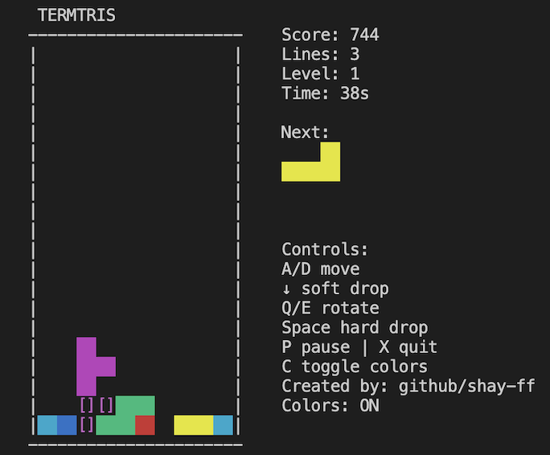

# termtris

**Terminal Tetris (termtris)** — a CLI game with persistent highscores.




---

## Installation

### 1. Clone the repo
```bash
git clone https://github.com/shay-ff/termtris.git
cd termtris
```
### 2. Create a Virtual Environment

**macOS / Unix**
```bash
python3 -m venv .venv
source .venv/bin/activate
```

**Windows**
```bash
python -m venv .venv
.venv\Scripts\activate
```

### 3. Install termtris

```bash
pip install .
```

Or run directly (without installing):

```bash
python -m termtris play
```

---

## Usage

### Start the Game

```bash
termtris
```

### Other Commands

```bash
termtris scores   # Show top scores
termtris reset    # Reset highscores
```

---

## Controls

| Key        | Action            |
|------------|-------------------|
| A / D      | Move left/right   |
| Down       | Soft drop         |
| Q / E      | Rotate left/right |
| Space      | Hard drop         |
| P          | Pause             |
| X          | Quit              |

Note: Arrow keys also move left/right in addition to A/D. Colors require a color-capable terminal (e.g., `xterm-256color`).

---

**Scores are stored in your user's config directory:**  
`~/.config/termtris/termtris.db`

**Have fun!**
